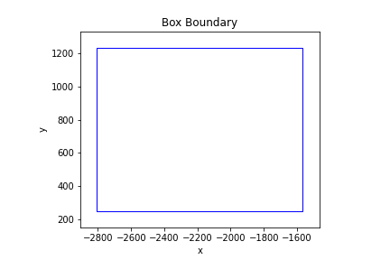
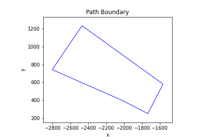
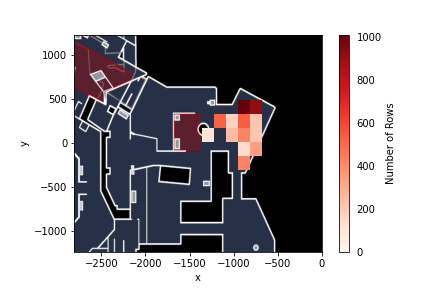

# Counter Strike Coaching Strategies - Analysis and Interpretation

First, I created an instance of the ProcessGameState class, ingesting and cleaning the .parquet file.

## Question 1: Is entering via the the light blue boundary a common strategy used by Team 2 on side T?
To answer this question, I employed two methods to test their efficiency and accuracy with regards to drawing the provided light blue boundary. 

### Naive Method
Using the ProcessGameState class method *check_boundaries()*, which simply uses the minimum and maximum values of x and y to draw a boundary box, we found that the number of rows in the dataset where the player was inside the light blue boundary is the following: 

    [0, 19, 4, 0, 0, 0, 0, 0, 0, 0, 0, 0, 0, 0, 0]

Each number in the list represents the number of observations in which Team 2 on T side was inside of the light blue boundary for rounds 16-30 of the game. The indices represent each of these 15 rounds.
These results show that the light blue boundary was only entered in rounds 17 and 18, so the number of rounds that Team 2 enters the boundary on T side is 2 out of 15 rounds. Therefore, with specifically this game in our scope, we can be certain that entering via the light blue boundary is **not** a common strategy used by Team 2 on side T.

### Matplotlib Path Method
Using the ProcessGameState method *check_boundaries_with_matplotlib()*, which draws a polygon given boundary coordinates, we found that the number of rows in the dataset where the player was inside the light blue boundary is the following:

    [0, 19, 0, 0, 0, 0, 0, 0, 0, 0, 0, 0, 0, 0, 0]
    
This output is very similar to the output produced using the naive method, with the small discrepancy residing within round 18. It seems as though the naive method might have captured observations that were not exactly within the light blue bounds, resulting in very slightly inaccurate results. However, the polygon ultimately shows that Team 2 enters the boundary on T side for 1 out of 15 rounds. So, the conclusion remains the same: entering via the light blue boundary is **not** a common strategy that Team 2 uses on side T. This definitely makes sense, as crossing the light blue boundary would mean that Team 2 crossed through A site and CT spawn as T, which means they willingly decided to not plant the bomb on A while on the site, planting on B instead.

### Analysis of Efficiency and Accuracy of Methods
**Efficiency**: Using the Jupyter Notebook %timeit command, I tested the runtime of both methods. Each method was tested in 3 runs, and 10 loops per run. 
- *check_boundaries()*, which uses the native approach, runs in 904 ms +- 3.54 ms per loop.
- *check_boundaries_with_matplotlib()*, which uses the polygon approach, runs in 910 ms +- 1.7 ms per loop.

There is a slight decrease in speed when drawing the polygon compared to drawing a box for the boundary, which makes the naive approach the objectively more efficient approach when drawing and checking boundaries for each row in the dataset.

**Accuracy**: As shown earlier using the output from each method, the method *check_boundaries_with_matplotlib()* had a slightly differing round 18 result, unable to detect 4 observations to be within the bounds. To see whether this is due to a shortcoming of the polygon or whether the box is too far-reaching, I visualized the shapes that each method illustrates for the light blue boundary.

|  |  |

It is very clear that the Matplotlib Path class does an excellent job at recreating the light blue boundary, while the box is extremely inaccurate with respect to the shape of the boundary. Therefore, the discrepancy in the round 18 results stems most definitely from the inaccuracy of the box boundary, and therefore the path boundary is the most accurate modeling of the provided boundary.

One could see how the box boundary could pose a huge problem in other sections of a map that polygon-shaped to a higher degree, which would render results using the box boundary to be extremely inaccurate and the polygon boundary to be an excellent model. 

**Conclusion**: Overall, the very slight decrease in runtime that results from drawing a polygon using the Matplotlib Path class is an excellent tradeoff for the increase in accuracy received not just with the light blue boundary, but potentially any future inquiry regarding player positioning across the entire map.

## Question 2: What is the average time at which Team 2 on T side enters bomb site B with at least 2 rifles or SMGs?

First, I called on my *extract_weapon_classes()* method to add a column to the data frame that included what weapon classes were used per row. I filtered the data to include only rows from Team 2's T side, as well as the 'area_name' being 'BombsiteB'. Then, I filtered this subset of the data to look for rows that contained 'Rifle' or "SMG' in the list of weapon classes used.

From this final filtered dataset, I collected the earliest timestamp that an observation was recorded in bomb site B per round and averaged these times. Thus, the mean time that Team 2 entered the bomb site on T side with rifles or SMGs is **01:12**. 

This information could be crucial to an opponent of Team 2, as it gives them a heads up as to how confident or aggressive a team is with a full load-out. It seems as though Team 2 is not overly aggressive, but also takes their time to plan an attack relatively methodically despite their full load-out.

## Question 3: Where should a coach suspect Team 2 on CT side will be waiting inside bomb site B?

To answer this critical question, I plotted a heatmap of Team 2's most played at CT locations on bomb site B, overlaid on top of the provided SimpleRadar map of Overpass. The data I used for this heatmap does not include data for after the bomb has been planted. This is because I figured that our question revolves around the best way to enter the site, so data after the bomb had been planted would be irrelevant for this purpose.

As shown on the heatmap, it seems as though Team 2 on the CT side tend to wait behind the top right corner of the map. This makes sense, as the corner provides cover from A side and also provides an angle towards the bottom entrances into bomb site B. Overall, the spread of where the team waits in bomb site B is collected around that top right corner of the site, with some activity alongside the circular landmark closer to the plant location.